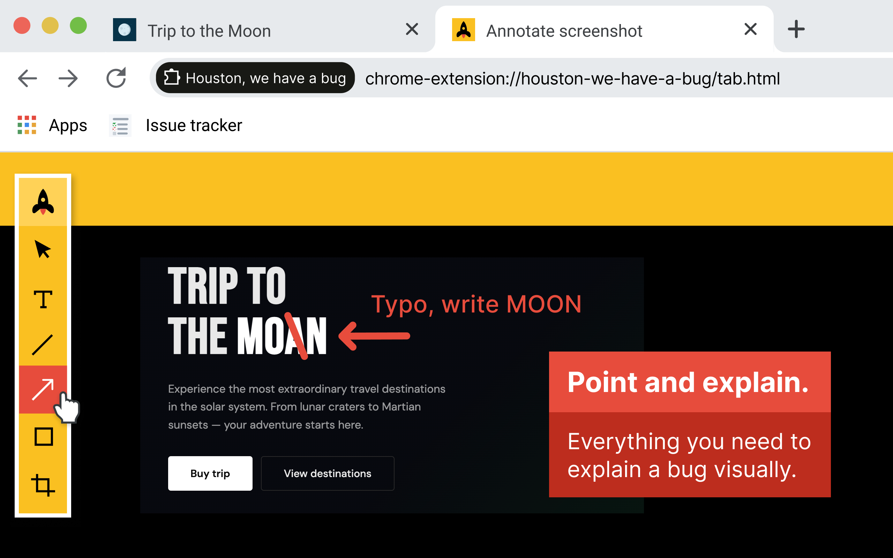
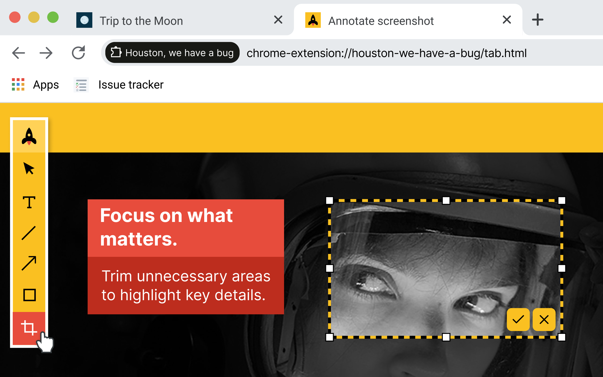
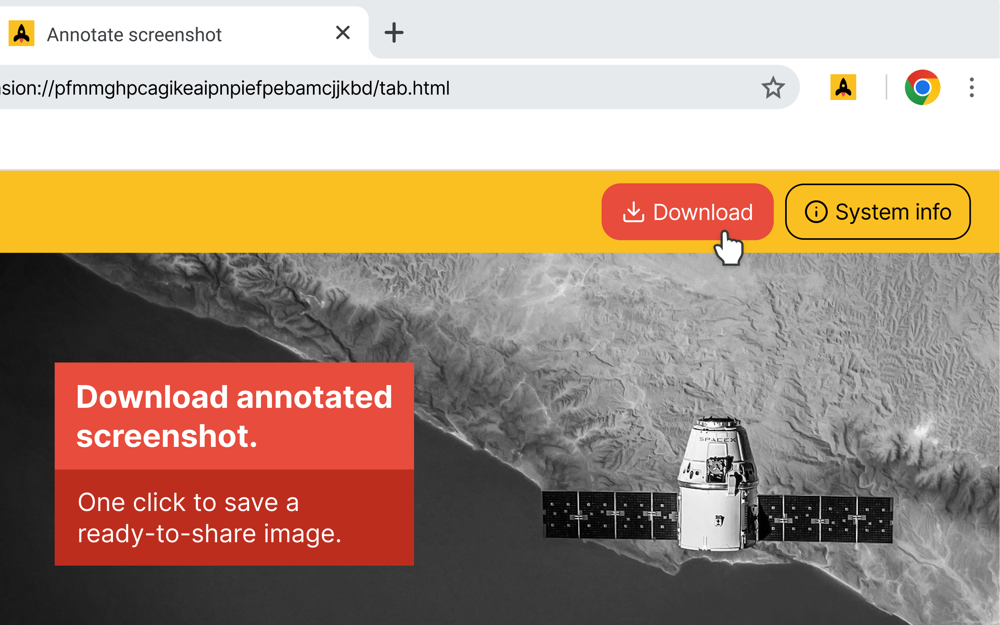
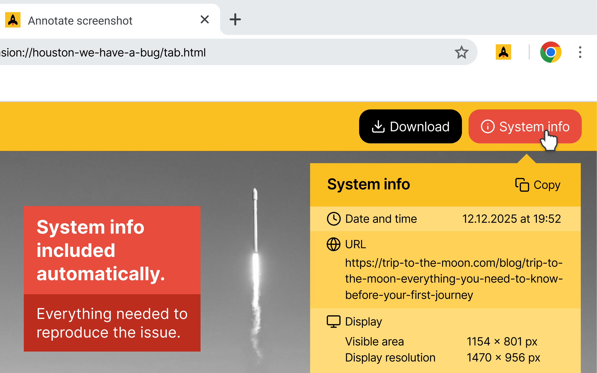

# Houston, we have a bug


A Chrome extension to capture bugs clearly. Annotate screenshots and gather system info.


<details>
  <summary>See presentation images</summary>

  <p align="center">
    
    
    
    
  </p>
</details>

> 🚧 **Status: Work in progress — not published**
>
> This Chrome extension is under active development and has **not been published
> to the Chrome Web Store yet**. Features, UX, and behavior may change.

## Key capabilities

- 📸 **Screenshot with annotations** - Capture visible tab and add annotations
- 📋 **System info** - Gather current date and time, URL, display settings, browser, and OS information
- 🗺️ **[Roadmap](ROADMAP.md)** - Planned features, and evolution

## Tech stack & tooling

- ⚡ **Lit** - Fast, lightweight web components framework by Google
- 📘 **TypeScript** - Fully typed extension code
- 🎨 **SCSS** - Styling with variables and nesting
- 🧪 **Vitest** - Unit testing framework with DOM simulation
- 🎭 **Playwright** - E2E testing for real browser behaviour
- 📦 **Modern build setup** - esbuild compilation with Prettier formatting

## Project structure

```
├── src/
│   ├── app.ts                    # Main Lit app component
│   ├── background.ts             # Service worker for screenshot/data handling
│   ├── entrypoints/
│   │   ├── popup.html            # Popup HTML entry
│   │   ├── popup.ts              # Popup TS entry
│   │   ├── tab.html              # Annotation tab HTML entry
│   │   └── tab.ts                # Annotation tab TS entry
│   ├── components/
│   │   ├── hb-popup/             # Popup component
│   │   ├── hb-annotation/        # Annotation editor component
│   │   ├── hb-toolbar/           # Annotation toolbar
│   │   ├── hb-toolbar-tool/      # Annotation toolbar tool
│   │   └── hb-canvas/            # Canvas for annotations
│   │       └── tools/            # Drawing tools (select, text, line, arrow, rectangle, crop)
│   ├── interfaces/               # TypeScript interfaces
│   ├── styles/
│   │   ├── _variables.scss       # Shared design tokens
│   │   ├── _buttons.scss         # Button styles
│   │   ├── app.scss              # App-level styles
│   │   └── fonts.css             # Global font-face declarations
│   ├── fonts/                    # Custom font files
│   ├── images/                   # Extension icons and assets
│   ├── utils/                    # Utility functions
│   └── types/                    # TypeScript types
├── testing-e2e/                 # Playwright E2E test specs
├── manifest.json                 # Extension configuration
├── tsconfig.json                 # TypeScript configuration
├── vitest.config.ts              # Test configuration
├── build.js                      # esbuild configuration
├── package.json                  # Dependencies and scripts
└── dist/                         # Compiled output (auto-generated)
```

## Installation & setup

### 1. Install dependencies

```bash
npm install
```

### 2. Build the extension

```bash
npm run build
```

This compiles TypeScript and SCSS into a single bundled JavaScript file.

### 3. Testing

Tests are automatically run before every commit using **Husky** hooks to ensure stability. To run manually

```bash
npm run test:all
```

### 4. Load in Chrome

1. Open Chrome and go to `chrome://extensions/`
2. Enable **Developer mode** (top right)
3. Click **Load unpacked** and select the `dist` folder
4. The extension will appear in your Chrome toolbar

### 5. Development mode

For continuous development with auto-compilation:

```bash
npm run dev
```

This builds once, then watches for changes and automatically rebuilds.
